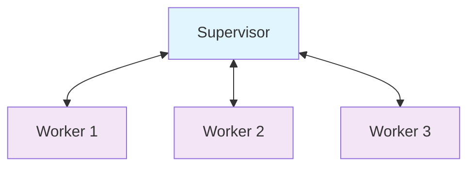
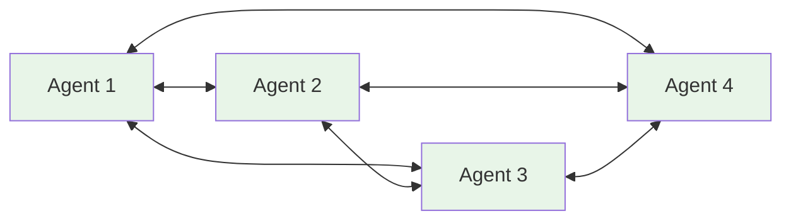
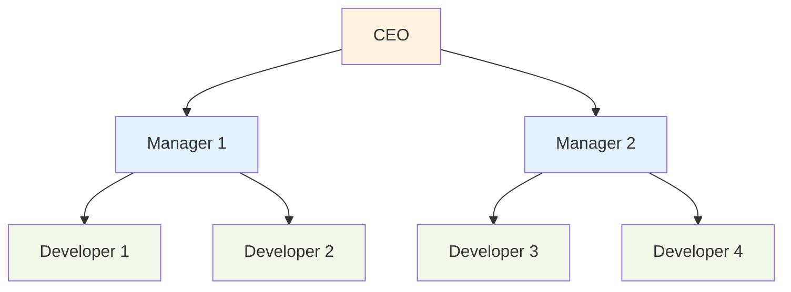
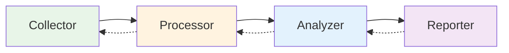
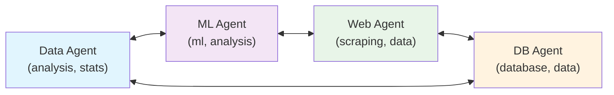
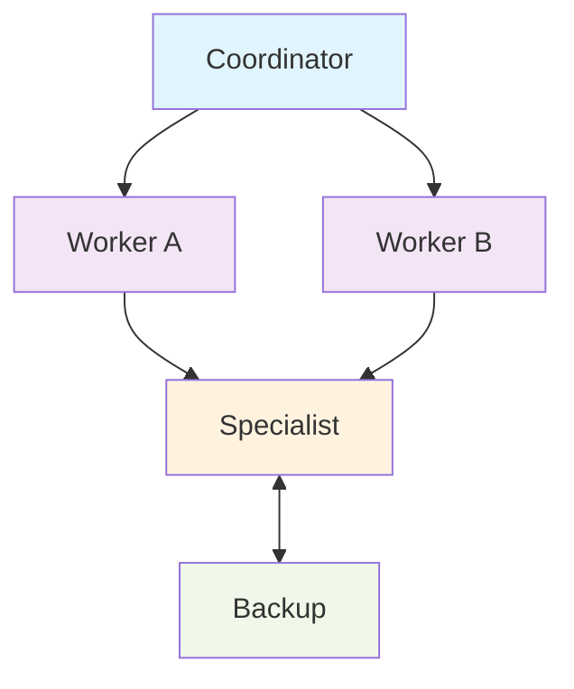

# 🚀 AgenticFlow Usage Guide

**Quick Start Guide for Building Multi-Agent AI Systems**

This guide focuses on practical usage of AgenticFlow - from basic agents to complex multi-agent systems. For complete feature documentation, see [README.md](README.md).

## 📦 Installation

### From GitHub (Currently the only method)
**Note: AgenticFlow is not yet published to PyPI. Install directly from GitHub:**
```bash
# Using UV (recommended)
uv add "git+https://github.com/milad-o/agenticflow.git[all]"

# Using pip
pip install "git+https://github.com/milad-o/agenticflow.git[all]"

# Basic installation without extras (minimal dependencies)
uv add "git+https://github.com/milad-o/agenticflow.git"
```

### Verify Installation
```bash
# Download and run the test script
curl -s https://raw.githubusercontent.com/milad-o/agenticflow/main/scripts/test_installation.py | python

# Or download and run locally
wget https://raw.githubusercontent.com/milad-o/agenticflow/main/scripts/test_installation.py
python test_installation.py

# Or test basic import
python -c "from agenticflow import Agent; print('✅ AgenticFlow installed successfully!')"
```

## 🔑 Setup

Set your API keys for the LLM providers you'll use:

```bash
# Required: At least one LLM provider
export OPENAI_API_KEY="your-openai-api-key"
export GROQ_API_KEY="your-groq-api-key"        # Free tier available

# Optional: For specific features
export PINECONE_API_KEY="your-pinecone-key"    # For Pinecone vector store
```

## 🤖 Basic Agent

**Create your first agent in 30 seconds:**

```python
import asyncio
from agenticflow import Agent
from agenticflow.config.settings import AgentConfig, LLMProviderConfig, LLMProvider

async def main():
    # Create agent configuration
    config = AgentConfig(
        name="my_assistant",
        instructions="You are a helpful AI assistant.",
        llm=LLMProviderConfig(
            provider=LLMProvider.GROQ,      # Fast and free
            model="llama-3.1-8b-instant"
        )
    )
    
    # Create and start agent
    agent = Agent(config)
    await agent.start()
    
    # Use your agent
    response = await agent.execute_task("What's the capital of France?")
    print(response['response'])
    
    await agent.stop()

if __name__ == "__main__":
    asyncio.run(main())
```

## 🛠️ Adding Tools

**Make your agent more capable with custom tools:**

```python
from agenticflow.tools import tool
import datetime

@tool("get_time", "Gets the current date and time")
def get_current_time() -> str:
    return datetime.datetime.now().strftime("%Y-%m-%d %H:%M:%S")

@tool("calculate", "Performs basic math calculations")
def calculate(expression: str) -> str:
    try:
        result = eval(expression)  # In production, use safer evaluation
        return f"Result: {result}"
    except:
        return "Invalid expression"

# Add tools to your agent
config = AgentConfig(
    name="tool_agent",
    instructions="You are a helpful assistant with access to tools.",
    llm=LLMProviderConfig(provider=LLMProvider.GROQ, model="llama-3.1-8b-instant"),
    tools=["get_time", "calculate"]  # Reference tools by name
)

agent = Agent(config)
await agent.start()

# Agent can now use tools automatically
response = await agent.execute_task("What time is it and what's 15 * 24?")
print(response['response'])
```

## 🧠 Memory Systems

**Give your agent persistent memory:**

```python
from agenticflow.config.settings import MemoryConfig

# Simple in-memory buffer (resets each session)
memory_config = MemoryConfig(type="buffer", max_messages=100)

# Persistent SQLite memory (remembers across sessions)
memory_config = MemoryConfig(
    type="sqlite",
    connection_params={"database": "my_agent.db"},
    max_messages=1000
)

# Use in agent config
config = AgentConfig(
    name="memory_agent",
    instructions="You are an assistant that remembers our conversations.",
    llm=LLMProviderConfig(provider=LLMProvider.GROQ, model="llama-3.1-8b-instant"),
    memory=memory_config
)
```

## 🏗️ Multi-Agent Systems

**Coordinate multiple agents working together:**

```python
from agenticflow.workflows.multi_agent import MultiAgentSystem
from agenticflow.workflows.topologies import TopologyType

# Create specialized agents
researcher_config = AgentConfig(
    name="researcher",
    instructions="You research topics and gather information.",
    llm=LLMProviderConfig(provider=LLMProvider.GROQ, model="llama-3.1-8b-instant")
)

writer_config = AgentConfig(
    name="writer", 
    instructions="You write content based on research.",
    llm=LLMProviderConfig(provider=LLMProvider.GROQ, model="llama-3.1-8b-instant")
)

supervisor_config = AgentConfig(
    name="supervisor",
    instructions="You coordinate research and writing tasks.",
    llm=LLMProviderConfig(provider=LLMProvider.GROQ, model="llama-3.1-8b-instant")
)

# Create multi-agent system
researcher = Agent(researcher_config)
writer = Agent(writer_config) 
supervisor = Agent(supervisor_config)

system = MultiAgentSystem(
    supervisor=supervisor,
    agents=[researcher, writer],
    topology=TopologyType.STAR  # Supervisor coordinates workers
)

await system.start()

# Execute collaborative task
result = await system.execute_task(
    "Research and write a brief article about renewable energy"
)

print(result['response'])
await system.stop()
```

### 🕸️ Different Topology Types

**Choose the right communication pattern for your agents:**

#### ⭐ Star Topology
Central supervisor coordinates all worker agents:



```python
system = MultiAgentSystem(
    supervisor=coordinator,
    agents=[worker1, worker2, worker3], 
    topology=TopologyType.STAR
)
```

#### 🔗 Peer-to-Peer Topology
All agents communicate directly with each other:



```python
system = MultiAgentSystem(
    agents=[agent1, agent2, agent3, agent4],
    topology=TopologyType.PEER_TO_PEER
)
```

#### 🌳 Hierarchical Topology
Tree-like organizational structure:



```python
system = MultiAgentSystem(
    agents=[ceo, manager1, manager2, dev1, dev2, dev3, dev4],
    topology=TopologyType.HIERARCHICAL
)
```

#### ➡️ Pipeline Topology
Sequential processing with feedback:



```python
system = MultiAgentSystem(
    agents=[collector, processor, analyzer, reporter],
    topology=TopologyType.PIPELINE
)
```

#### 🕸️ Mesh Topology
Selective connectivity based on capabilities/proximity:



```python
# Mesh - Selective connectivity
mesh_topology = MeshTopology(
    "smart_mesh",
    max_connections_per_agent=2,
    connectivity_strategy="capability_based"
)

system = MultiAgentSystem(
    agents=[data_agent, ml_agent, web_agent, db_agent],
    topology=mesh_topology
)

# See connection statistics
stats = mesh_topology.get_connection_stats()
print(f"Network connectivity: {stats['connectivity_ratio']:.2%}")
```

#### 🎨 Custom Topology
User-defined communication patterns:



```python
from agenticflow.workflows.topologies import CustomTopology, CommunicationRoute

custom_topology = CustomTopology("my_pattern")

def my_rule(agent_nodes):
    routes = []
    # Define your custom communication pattern
    return routes

custom_topology.add_custom_rule(my_rule)
```

**Try the mesh topology example:**
```bash
uv run python examples/workflows/mesh_topology_example.py
```

## 📊 Workflow Visualization

**Visualize your agents and workflows with modern diagrams:**

```python
# Visualize any agent directly
agent.visualize()  # Opens diagram in browser
agent.show()       # Shows in Jupyter notebook

# Visualize multi-agent systems
system.visualize(title="Content Creation Pipeline")

# Create custom workflow diagrams
from agenticflow.visualization.mermaid_generator import (
    MermaidGenerator, NodeShape, MermaidTheme, ThemeVariables
)

generator = MermaidGenerator(use_modern_syntax=True)
generator.set_title("AI Processing Pipeline")
generator.set_theme(MermaidTheme.BASE, ThemeVariables(primary_color="#2563eb"))

# Modern node shapes (v11.3.0+)
generator.add_node("input", "Data Input", NodeShape.EVENT)
generator.add_node("process", "AI Processing", NodeShape.PROCESS)
generator.add_node("db", "Store Results", NodeShape.DATABASE)
generator.add_node("output", "Deliver Response", NodeShape.TERMINAL)

generator.add_edge("input", "process", "Raw Data")
generator.add_edge("process", "db", "Processed Data")
generator.add_edge("db", "output", "Final Result")

print(generator.generate())  # Mermaid diagram with frontmatter
```

**See it in action:**
```bash
# Modern Mermaid features showcase
uv run python examples/visualization/test_modern_mermaid_features.py
```

## 📊 Task Orchestration

**Manage complex workflows with dependencies:**

```python
from agenticflow.orchestration.task_orchestrator import TaskOrchestrator
from agenticflow.orchestration.task_management import TaskPriority

# Create orchestrator
orchestrator = TaskOrchestrator(max_concurrent_tasks=4)

# Add tasks with dependencies
orchestrator.add_function_task(
    task_id="research",
    description="Research the topic",
    function=research_function,
    priority=TaskPriority.HIGH
)

orchestrator.add_function_task(
    task_id="analyze", 
    description="Analyze research data",
    function=analyze_function,
    dependencies=["research"],  # Wait for research to complete
    priority=TaskPriority.MEDIUM
)

orchestrator.add_function_task(
    task_id="report",
    description="Generate final report", 
    function=report_function,
    dependencies=["analyze"],   # Wait for analysis
    priority=TaskPriority.HIGH
)

# Execute workflow
results = await orchestrator.execute_workflow()
print(f"Completed {len(results)} tasks")
```

## 🔌 External Tool Integration (MCP)

**Connect to external services via Model Context Protocol:**

```python
from agenticflow.mcp.config import MCPServerConfig, MCPConfig

# Configure external MCP server
calculator_server = MCPServerConfig(
    name="calculator",
    command=["python", "calculator_server.py"],
    expected_tools=["calculate", "convert_units"],
    timeout=30.0
)

# Add MCP integration to agent
mcp_config = MCPConfig(
    servers=[calculator_server],
    auto_register_tools=True,  # Automatically discover and register tools
    tool_namespace=True        # Namespace tools as "calculator.calculate"
)

config = AgentConfig(
    name="mcp_agent",
    instructions="You can perform calculations using external tools.",
    llm=LLMProviderConfig(provider=LLMProvider.GROQ, model="llama-3.1-8b-instant"),
    mcp_config=mcp_config
)

agent = Agent(config)
await agent.start()

# Agent can now use external calculator tools
response = await agent.execute_task("Calculate the compound interest on $1000 at 5% for 3 years")
```

## 📈 Real-World Example: Sales Analysis

**Complete business system processing real data:**

```python
# This example processes sales data from text files into business insights
# Located at: examples/realistic_systems/sales_analysis/

# Set up Groq API key
export GROQ_API_KEY="your-groq-api-key"

# Run the system
uv run python examples/realistic_systems/sales_analysis/simple_sales_analysis.py

# Results: Processes $96K+ revenue data with 27.5% growth analysis
# - Converts unstructured text to structured CSV
# - Generates comprehensive business intelligence 
# - Multi-agent coordination for complex workflows
```

## 🔧 Configuration Patterns

### Agent Specialization
```python
# Data Analyst Agent
analyst_config = AgentConfig(
    name="data_analyst",
    instructions="You are an expert data scientist with access to analysis tools.",
    llm=LLMProviderConfig(provider=LLMProvider.GROQ, model="llama-3.1-70b-versatile"),
    tools=["analyze_data", "generate_report", "visualize_trends"]
)

# Customer Service Agent  
service_config = AgentConfig(
    name="customer_service",
    instructions="You provide helpful customer support with access to order systems.",
    llm=LLMProviderConfig(provider=LLLProvider.OPENAI, model="gpt-4o-mini"),
    tools=["lookup_order", "process_refund", "escalate_issue"],
    memory=MemoryConfig(type="sqlite", connection_params={"database": "customers.db"})
)
```

### Production Configuration
```python
# Production-ready agent with full features
production_config = AgentConfig(
    name="production_agent",
    instructions="Production AI assistant with comprehensive capabilities.",
    llm=LLMProviderConfig(
        provider=LLMProvider.OPENAI,
        model="gpt-4o",
        temperature=0.1,        # Lower temperature for consistency
        max_tokens=2048,
        timeout=60,
        max_retries=3
    ),
    memory=MemoryConfig(
        type="postgresql", 
        connection_params={
            "host": "localhost",
            "database": "agents",
            "user": "agent_user"
        },
        max_messages=10000
    ),
    enable_self_verification=True,
    enable_a2a_communication=True,
    max_retries=3
)
```

## 🎯 Common Use Cases

### 1. **Personal Assistant**
```python
assistant = Agent(AgentConfig(
    name="personal_assistant",
    instructions="You help with daily tasks, scheduling, and information.",
    llm=LLMProviderConfig(provider=LLMProvider.GROQ, model="llama-3.1-8b-instant"),
    tools=["get_time", "search_web", "send_email"],
    memory=MemoryConfig(type="sqlite", connection_params={"database": "assistant.db"})
))
```

### 2. **Content Creation Team**
```python
# Research → Write → Edit → Publish pipeline
research_agent = Agent(research_config)
writing_agent = Agent(writing_config)
editing_agent = Agent(editing_config)

content_system = MultiAgentSystem(
    supervisor=coordinator_agent,
    agents=[research_agent, writing_agent, editing_agent],
    topology=TopologyType.PIPELINE
)
```

### 3. **Customer Support System**
```python
# Route → Analyze → Respond → Escalate workflow
routing_agent = Agent(routing_config)
analysis_agent = Agent(analysis_config) 
response_agent = Agent(response_config)

support_system = MultiAgentSystem(
    supervisor=supervisor_agent,
    agents=[routing_agent, analysis_agent, response_agent],
    topology=TopologyType.HIERARCHICAL
)
```

## 🚨 Error Handling

**Robust error handling and retries:**

```python
from agenticflow.orchestration.task_management import RetryPolicy

# Configure retry behavior
retry_policy = RetryPolicy(
    max_attempts=3,
    initial_delay=1.0,
    max_delay=30.0, 
    backoff_multiplier=2.0,
    jitter=True
)

config = AgentConfig(
    name="robust_agent",
    instructions="You handle tasks reliably with error recovery.",
    llm=LLMProviderConfig(provider=LLMProvider.GROQ, model="llama-3.1-8b-instant"),
    max_retries=3
)

# Orchestrator with retry policies
orchestrator = TaskOrchestrator(
    max_concurrent_tasks=4,
    default_retry_policy=retry_policy
)
```

## 🔍 Debugging & Monitoring

**Track your agents' performance:**

```python
import logging

# Enable debug logging
logging.basicConfig(level=logging.DEBUG)

# Monitor task execution
orchestrator = TaskOrchestrator(max_concurrent_tasks=4)
results = await orchestrator.execute_workflow()

# Check execution statistics
stats = orchestrator.get_execution_stats()
print(f"Success rate: {stats.success_rate}%")
print(f"Total execution time: {stats.total_time}s")
print(f"Tasks completed: {stats.completed_tasks}")
```

## 📚 Next Steps

1. **Explore Examples**: Check out `examples/` directory for comprehensive demonstrations
2. **Advanced Features**: See [README.md](README.md) for vector stores, advanced memory, and more
3. **Production Deployment**: Review deployment patterns and scaling strategies
4. **Community**: Join discussions and contribute to the project

## ⚡ Quick Commands Reference

```bash
# Install
uv add "git+https://github.com/milad-o/agenticflow.git[all]"

# Run examples (after cloning the repo)
git clone https://github.com/milad-o/agenticflow.git
cd agenticflow
uv run python examples/tools/final_tool_calling_validation.py
uv run python examples/chatbots/rag_supervision_example.py
uv run python examples/realistic_systems/sales_analysis/simple_sales_analysis.py

# Test installation  
python -c "from agenticflow import Agent; print('AgenticFlow installed!')"

# Or run comprehensive installation test
curl -s https://raw.githubusercontent.com/milad-o/agenticflow/main/scripts/test_installation.py | python
```

---

**Get started in minutes, scale to production!** 🚀

For complete documentation, advanced features, and architecture details, see the [full README](README.md).